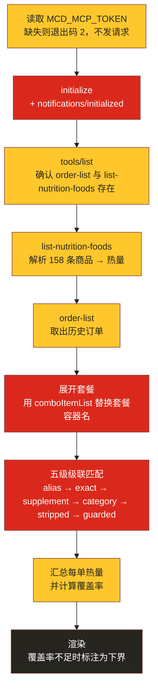
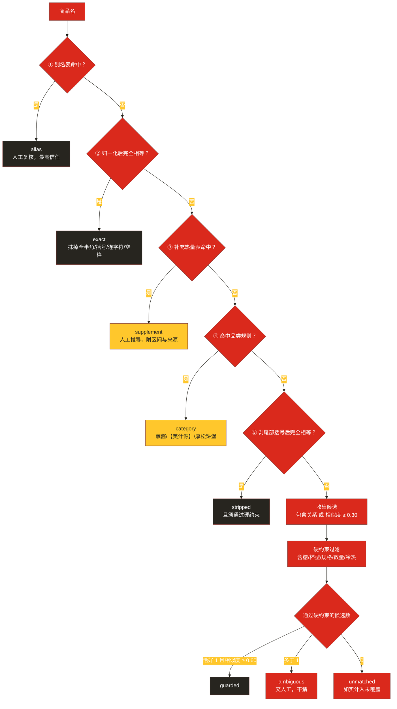

# MCP 集成说明

本文件说明**订单卡路里一览**实际使用的麦当劳 MCP Server、Tool、调用流程与业务价值。按大赛要求，这里写的是项目**真实发起**的调用，而非设计构想。

---

## 一、使用的 MCP Server

| 项目 | 值 |
|---|---|
| Server 名称 | `mcd-mcp`（麦当劳中国 MCP Server） |
| 类型 | `streamablehttp` |
| 地址 | `https://mcp.mcd.cn` |
| 鉴权 | HTTP Header `Authorization: Bearer <MCD_MCP_TOKEN>` |
| 协议版本 | `2025-06-18` |
| 客户端实现 | 本项目自带 `src/mcd_order_calories/mcp_client.py`（仅 Python 标准库，无第三方依赖） |
| Token 申请 | https://github.com/M-China/mcd-mcp-server |

客户端实现的 MCP 方法：`initialize` → `notifications/initialized` → `tools/list` → `tools/call`，并透传服务端下发的 `Mcp-Session-Id`、退出时尝试 `DELETE` 释放会话。

> ⚠️ Token 为个人申请，仅通过环境变量传入，**不写入本仓库任何文件**。仓库内的 [`mcp-config.example.json`](./mcp-config.example.json) 只含环境变量占位符。

```json
{
  "mcpServers": {
    "mcd-mcp": {
      "type": "streamablehttp",
      "url": "https://mcp.mcd.cn",
      "headers": { "Authorization": "Bearer ${MCD_MCP_TOKEN}" }
    }
  }
}
```

---

## 二、使用的 Tool 清单

### 2.1 核心工具（每次运行必调）

| Tool | 用途 | 在本项目中的角色 |
|---|---|---|
| `order-list` | 查询历史订单（非商城订单） | **唯一能知道你实际吃了什么的数据源**。返回订单商品、套餐成分 `comboItemList`、门店与 `realTotalAmount` |
| `list-nutrition-foods` | 获取餐品营养成分 | **唯一有热量的数据源**。返回 158 条商品名 → `energyKcal` |

**这两个工具的关系就是本项目的全部难点**：订单按 `productCode` + 商品名组织，营养表**只有商品名、没有 code**，所以只能按名字对齐。

### 2.2 辅助工具（可选，用于诊断与交叉验证）

| Tool | 用途 | 说明 |
|---|---|---|
| `query-meals` | 查门店当前菜单 | 用于**按 productCode 反查官方商品名**。实测命中率仅 35%——因为菜单只反映**当前在售**，季节品与已下架商品查不到，故仅作辅助而非主要对齐手段 |
| `query-meal-detail` | 查餐品套餐组成 | 同上，用于确认为什么某个商品名对不上 |
| `now-time-info` | 服务端当前时间 | 诊断用 |

> **本项目不调用任何写操作**：不涉及 `create-order` / `mall-create-order` / `party-order-create` / `cancel-order` / `auto-bind-coupons` / `draw-lottery` / `delivery-create-address`。全程只读。

---

## 三、调用流程



### 五级匹配的详细决策流



---

## 四、工程细节

### 4.1 踩过的两个真实坑

**① 服务端返回的不是裸 JSON，而是「字段说明 + JSON」混排：**

```
## Response Structure
- **门店名称**: data[].storeName      ← 注意这里的 data[]
## Original Response
{"success":true,...,"data":[...]}
```

说明段里的 `data[]` **含方括号**，会让 `\[.*\]` 这类简单正则抢先匹配、解析出空结果（本项目第一版就中了）。稳健做法是**从最后一个 `{"success"` 起**截取。

**② 营养表是自定义分隔格式**，既不是 JSON 也不是标准 CSV：

```
[160]{productName,nutritionDescription,energyKj,energyKcal,protein,fat,carbohydrate,sodium,calcium}:
  猪柳麦满分,null,1288,308,16,16,24,781,213
```

表头声明 160 条，实际去重后 158 条（`小杯玉米杯`、`纯牛奶（盒装）` 重复）。本项目会**如实报告数据源自身的质量问题**，而不是静默吞掉。

### 4.2 错误处理

| 情况 | 行为 |
|---|---|
| 无 Token | 退出码 `2`，提示申请地址，**不发网络请求** |
| Token 无效 / 过期 | 退出码 `1`，翻译为 `HTTP 401 ... check MCD_MCP_TOKEN is set and valid`，并附服务端原文 |
| 网络不可达 / 超时 | 退出码 `1`，报告目标 URL 与底层原因 |
| 服务端返回 JSON-RPC error | 抛出 `McpError`，携带 `code` 与 `message` |
| 返回文本里没有 JSON | 抛出 `PayloadError`，打印前 120 字符便于定位 |
| 补充表缺少推导/区间/来源 | **加载期直接报错**，不允许无依据的数值进表 |
| 品类规则正则写错 | **加载期直接报错**，避免规则静默失效退化成「查不到」 |

### 4.3 安全与脱敏

- Token 只从环境变量或 `--token` 读取，**不落盘、不进日志**。
- 仓库内不含真实 Token、密钥、账号凭证、手机号、邮箱或他人个人信息。
- 仓库内的运行示例**已隐去账号标识**，只保留商品与热量结构。
- **全程只读**：不调用任何下单 / 领券 / 抽奖 / 改地址等写接口。
- 仅通过官方 MCP 接口访问数据，未抓取、未内嵌任何非公开数据。

### 4.4 兼容性

仅依赖 Python 标准库（`json` / `urllib` / `socket` / `re` / `unicodedata` / `dataclasses`），Python 3.9+ 直接运行，无需安装 MCP SDK。测试用标准库 `unittest`，`clone` 下来零安装即可复现全部 84 项。

---

## 五、业务价值

### 5.1 对用户

1. **补上 App 缺失的一环**——麦当劳 App 只显示订单，不显示热量。本项目把「你实际吃进去什么」变成看得懂的数字。
2. **套餐自动展开**——「人气经典随心配」这类容器名无法直接匹配营养表，本项目用 `comboItemList` 展开成真实成分再说。
3. **不骗人**——算不出来的部分**如实披露**，而不是拿一个偏低的下界冒充总量。实测某单只覆盖 1/4 时算出 87 kcal，而真实值在 800 kcal 以上；只给数字不给出覆盖率是危险的。
4. **每个数都能追溯**——估算值附区间、置信度与推导过程。

### 5.2 对麦当劳

1. **激活低频 Tool**——`list-nutrition-foods` 在点餐类作品里几乎只被当作"热量排序"的辅助数据，本项目把它与 `order-list` 真正**联接**起来，形成新的数据价值。
2. **不产生额外负载**——单次运行仅 2 次 MCP 调用（`list-nutrition-foods` + `order-list`），无循环、无爬虫式流量。
3. **全站最克制的一类作品**——只读、不下单、不改账号状态，零副作用。

### 5.3 作为 MCP 工程范式参考

项目沉淀了四个可复用实践：

1. **混合数据源对齐**——当两个接口无法用 ID 关联、只能靠名称匹配时，如何用「归一化 + 硬约束 + 唯一性 + 阈值标定」建立可审计的匹配层；
2. **假阳性优先防御**——用真实数据标定阈值，并记录已知假阳性作为回归防线；
3. **覆盖率披露原则**——宁可给出带区间的下界，也不给一个看起来精确的错数；
4. **估算值可审计**——强制要求推导过程 + 误差区间 + 非官方来源标注，缺一即加载报错。

---

## 六、如何自行验证

```bash
export MCD_MCP_TOKEN="你的 Token"

mcd-calories doctor                     # 1) 连通性与所需工具
mcd-calories                            # 2) 订单卡路里一览
mcd-calories --detail                   # 3) 展开每单明细与推导
mcd-calories explain 双层脆鸡堡           # 4) 单商品判定理由与候选
mcd-calories gaps                       # 5) 未匹配商品（已知缺口 / 新出现）

PYTHONPATH=src python3 -m unittest discover -s tests -t tests   # 6) 84 项测试
```

**本项目不产生任何写操作**，全部命令都是只读的。
